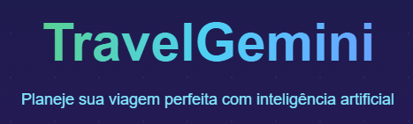
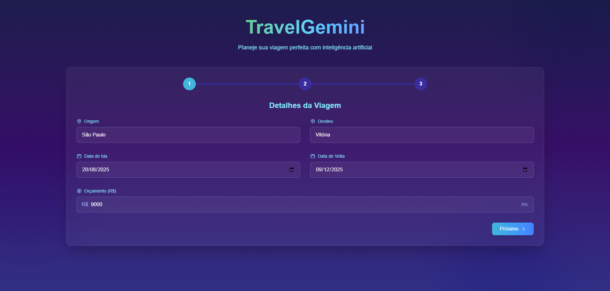

# TravelGemini - Planejador Inteligente de Viagens com IA

TravelGemini é um planejador de viagens com inteligência artificial que utiliza a API Gemini do Google para criar roteiros personalizados com base nas preferências do usuário. A aplicação foi desenvolvida com Next.js e oferece uma interface moderna para planejar todos os aspectos da sua viagem.

<div align="center">
  
</div>

## Funcionalidades

- **Planejamento Completo de Viagens**: Geração de roteiros detalhados baseados no seu destino, datas e preferências
- **Sugestões de Transporte**: Opções de deslocamento com preços estimados e comparativos
- **Recomendações de Hospedagem**: Seleção de hotéis, pousadas e acomodações de acordo com o seu orçamento
- **Roteiro de Atrações**: Pontos turísticos e experiências adaptadas aos seus interesses
- **Relatório Detalhado**: Compilação de todas as informações em um plano de viagem coeso
- **Chat Interativo com IA**: Assistente de viagem personalizado para tirar dúvidas específicas sobre seu destino

## Configuração da API Key

Para utilizar este projeto, você precisará de uma API Key do Google Gemini:

1. Obtenha sua chave de API em [https://makersuite.google.com/app/apikey](https://makersuite.google.com/app/apikey)
2. Abra o arquivo `src/app/api/planejar/route.js`
3. Substitua `"GOOGLE_API_KEY"` pela sua chave de API:

```javascript
const apiKey = "SUA_CHAVE_DE_API_AQUI"
```

> **IMPORTANTE**: Nunca compartilhe sua chave de API ou faça commit dela em repositórios públicos.

## Tecnologias Utilizadas

- **Next.js**: Framework React para frontend e API routes
- **Tailwind CSS**: Framework de estilização
- **Google Gemini API**: Modelo de IA para geração de conteúdo e chat interativo
- **Biblioteca Marked**: Renderização de conteúdo markdown

## Como Executar o Projeto

1. Clone o repositório:
   ```bash
   git clone https://github.com/seu-usuario/travel-gemini.git
   cd travel-gemini
   ```

2. Instale as dependências:
   ```bash
   npm install
   ```
   
3. Configure sua API Key do Google como explicado acima

4. Execute o servidor de desenvolvimento:
   ```bash
   npm run dev
   ```

5. Acesse [http://localhost:3000](http://localhost:3000) no seu navegador

## Estrutura do Projeto

<div align="center">
  
</div>


- `/src/app/page.js`: Interface principal da aplicação
- `/src/app/api/planejar/route.js`: API Route que integra com o Google Gemini
- `/src/app/api/planejar/chat/route.js`: API Route para a funcionalidade de chat interativo
- `/src/app/api/planejar/agenteChat.js`: Módulo com agente especializado para processamento de mensagens de chat

## Como Usar

1. Preencha o formulário com seus dados de viagem (origem, destino, datas, etc.)
2. Defina suas preferências, orçamento e interesses
3. Clique em "Planejar Minha Viagem"
4. Aguarde enquanto a IA gera um planejamento personalizado
5. Explore as diferentes abas para ver detalhes sobre transporte, hospedagem e atrações
6. Use o botão de chat no canto inferior esquerdo para conversar com o assistente IA sobre seu destino

## Funcionalidade de Chat

O TravelGemini agora conta com um assistente de viagem inteligente que você pode acessar através do botão de chat no canto inferior esquerdo da tela. Este assistente permite:

- **Perguntas Específicas**: Tire dúvidas sobre o seu destino, restaurantes, pontos turísticos, etc.
- **Contexto Inteligente**: O chat utiliza as informações do seu planejamento para fornecer respostas personalizadas
- **Suporte Multilíngue**: Receba respostas em português do Brasil
- **Interface Amigável**: Design moderno e intuitivo com suporte para formatação em markdown

Para utilizar o chat, basta clicar no ícone de mensagem, digitar sua pergunta e enviar. O assistente fornecerá informações detalhadas e relevantes sobre seu destino de viagem.

## Licença

Este projeto está sob a licença MIT.

## Desenvolvido por
Gustavo Santos

Estudante de Engenharia de Software


<a href="https://www.linkedin.com/in/gustavo-santos-483202253/">LinkedIn</a>
